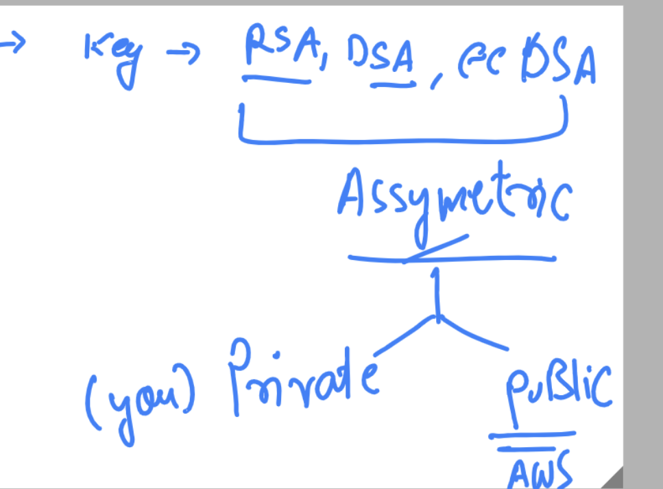

## Terraform getting started

### terraform running steps 

## Init 

```
PS C:\Users\Administrator\Desktop\my-terraform-cde> terraform init 

Initializing the backend...

Initializing provider plugins...
- Finding latest version of hashicorp/aws...
- Installing hashicorp/aws v4.64.0...
- Installed hashicorp/aws v4
```

## PLAN 

```
PS C:\Users\Administrator\Desktop\my-terraform-cde> ls

PS C:\Users\Administrator\Desktop\my-terraform-cde> terraform plan

Terraform used the selected providers to generate the following execution plan. Resource actions are
indicated with the following symbols:
  + create

Terraform will perform the following actions:

  # aws_instance.ashu-vm1 will be created
```


### APPLY 

```
terraform apply 


Plan: 1 to add, 0 to change, 0 to destroy.

Do you want to perform these actions?
  Terraform will perform the actions described above.
  Only 'yes' will be accepted to approve.

  Enter a value: yes

aws_instance.ashu-vm1: Creating...
aws_instance.ashu-vm1: Still creating... [10s elapsed]
aws_instance.ashu-vm1: Still creating... [20s elapsed]
aws_instance.ashu-vm1: Creation complete after 21s [id=i-051ac3fc5b54e64f9]

```

### terraform destroy 

```
PS C:\Users\Administrator\Desktop\my-terraform-cde> terraform  destroy
aws_instance.ashu-vm1: Refreshing state... [id=i-051ac3fc5b54e64f9]

Terraform used the selected providers to generate the following execution plan. Resource actions are
indicated with the following symbols:
  - destroy

Terraform will perform the following actions:

  # aws_instance.ashu-vm1 will be destroyed
  - resource "aws_instance" "ashu-vm1" {
      - ami                                 
```

## COncept of key pair in cloud 



### Generating key pair using ssh-keygen 

```

PS C:\Users\Administrator> ssh-keygen.exe
Generating public/private rsa key pair.
Enter file in which to save the key (C:\Users\Administrator/.ssh/id_rsa):
C:\Users\Administrator/.ssh/id_rsa already exists.
Overwrite (y/n)? y
Enter passphrase (empty for no passphrase):
Enter same passphrase again:
Your identification has been saved in C:\Users\Administrator/.ssh/id_rsa.
Your public key has been saved in C:\Users\Administrator/.ssh/id_rsa.pub.
The key fingerprint is:
SHA256:MhuK9p1vveaoxDzq9DstP1B/zQiQxqoCzpDQENOpB4Y administrator@EC2AMAZ-U1R5103
The key's randomart image is:
+---[RSA 3072]----+
|== .   . .       |
|Eo+     =        |
|o+     o .       |
```


